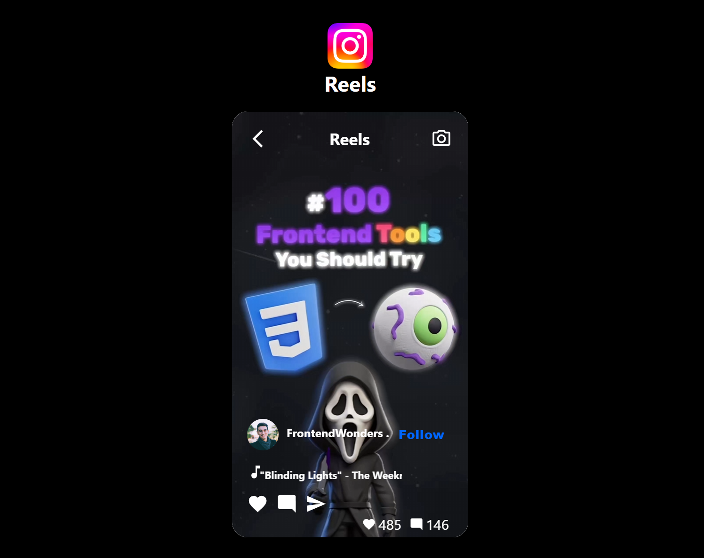

# Instagram Reels Clone

A simple Instagram Reels clone built using React, Material-UI, and CSS.

## Technologies Used

### React

React is a JavaScript library for building user interfaces. It allows the creation of reusable UI components.

- [React Documentation](https://reactjs.org/)
- 
### Material-UI

### CSS

CSS (Cascading Style Sheets) is a style sheet language used for describing the look and formatting of a document written in HTML.

- [MDN Web Docs - CSS](https://developer.mozilla.org/en-US/docs/Web/CSS)

